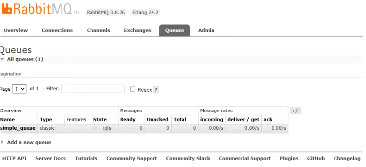

# rabbitmq-demo

# 一.7种基本模式

## 1.1 简单模式 (The simplest thing that does *something*)


消息提供者:

```java
   private final static String QUEUE_NAME = "simple_queue";

    public static void main(String[] argv) throws Exception {
        // 获取到连接以及mq通道
        Connection connection = ConnectionUtil.getConnection();
        // 从连接中创建通道，这是完成大部分API的地方。
        Channel channel = connection.createChannel();

        // 声明（创建）队列，必须声明队列才能够发送消息，我们可以把消息发送到队列中。
        // 声明一个队列是幂等的 - 只有当它不存在时才会被创建
        channel.queueDeclare(QUEUE_NAME, false, false, false, null);

        // 消息内容
        String message = "Hello World!";
        channel.basicPublish("", QUEUE_NAME, null, message.getBytes());
        log.info("send消息:{}",message);

        //关闭通道和连接
        channel.close();
        connection.close();
    }
```


### 消息消费者(自动提供ack)：

```java
private final static String QUEUE_NAME = "simple_queue";

    public static void main(String[] argv) throws Exception {
        // 获取到连接
        Connection connection = ConnectionUtil.getConnection();
        // 创建通道
        Channel channel = connection.createChannel();
        // 声明队列
        channel.queueDeclare(QUEUE_NAME, false, false, false, null);
        // 定义队列的消费者
        DefaultConsumer consumer = new DefaultConsumer(channel) {
            // 获取消息，并且处理，这个方法类似事件监听，如果有消息的时候，会被自动调用
            @Override
            public void handleDelivery(String consumerTag, Envelope envelope, AMQP.BasicProperties properties,
                                       byte[] body) throws IOException {
                // body 即消息体
                String msg = new String(body);
                log.info("收到simpleProvider消息 {}" + msg + "!");
            }
        };
        // 监听队列，第二个参数：是否自动进行消息确认。
        channel.basicConsume(QUEUE_NAME, true, consumer);
    }
```

### 消息消费者(手动提供ack)：

```java
private final static String QUEUE_NAME = "simple_queue";

    public static void main(String[] argv) throws Exception {
        // 获取到连接
        Connection connection = ConnectionUtil.getConnection();
        // 创建通道
        Channel channel = connection.createChannel();
        // 声明队列
        channel.queueDeclare(QUEUE_NAME, false, false, false, null);
        // 定义队列的消费者
        DefaultConsumer consumer = new DefaultConsumer(channel) {
            // 获取消息，并且处理，这个方法类似事件监听，如果有消息的时候，会被自动调用
            @Override
            public void handleDelivery(String consumerTag, Envelope envelope, AMQP.BasicProperties properties,
                                       byte[] body) throws IOException {
                // body 即消息体
                String msg = new String(body);
                log.info("收到simpleProvider消息 {}" + msg + "!");
                //手动ack
                channel.basicAck(envelope.getDeliveryTag(), false);
            }
        };
        //异常测试手动ack
        //int i=1/0;
        // 监听队列，第二个参数为false,手动ack
        channel.basicConsume(QUEUE_NAME, false, consumer);
    }
```


### 其中rabbitmq中显示



**如果消息十分重要，建议使用`手动ack`，但是代码中并没有进行消息确认！所以消息并未被真正消费掉。当我们关掉这个消费者，消息的状态再次称为Ready，具体是否手动取决实际场景!**


## 1.2 工作队列（Distributing tasks among workers (the [competing consumers pattern](http://www.enterpriseintegrationpatterns.com/patterns/messaging/CompetingConsumers.html))）


### 消息提供者:

```java
private final static String WORK_QUEUE_NAME = "work_queue";

    public static void main(String[] argv) throws Exception {
        // 获取到连接以及mq通道
        Connection connection = ConnectionUtil.getConnection();
        // 从连接中创建通道，这是完成大部分API的地方。
        Channel channel = connection.createChannel();

        // 声明（创建）队列，必须声明队列才能够发送消息，我们可以把消息发送到队列中。
        // 声明一个队列是幂等的 - 只有当它不存在时才会被创建
        channel.queueDeclare(WORK_QUEUE_NAME, true, false, false, null);

        // 消息内容
        for (int i = 0; i < 100; i++) {
            String message = "第"+i+"条"+"study work_queue!";
            channel.basicPublish("", WORK_QUEUE_NAME, MessageProperties.PERSISTENT_TEXT_PLAIN, message.getBytes("UTF-8"));
            System.out.println(" [x] Sent '" + message+"'");
        }
        //关闭通道和连接
        channel.close();
        connection.close();
    }
```

### 消息消费者c1:

```java
private final static String WORK_QUEUE_NAME = "work_queue";

    public static void main(String[] argv) throws Exception {
        // 获取到连接
        Connection connection = ConnectionUtil.getConnection();
        // 创建通道
        Channel channel = connection.createChannel();
        // 声明队列
        channel.queueDeclare(WORK_QUEUE_NAME, true, false, false, null);
        System.out.println(" [*] Waiting for messages. To exit press CTRL+C");
        // 定义队列的消费者
        DeliverCallback deliverCallback = (consumerTag, delivery) -> {
            String message = new String(delivery.getBody(), "UTF-8");

            System.out.println(" [x] Received '" + message + "'");
            try {
                //模拟耗时
                doWork(message);
            } finally {
                System.out.println(" [x] Done");
                channel.basicAck(delivery.getEnvelope().getDeliveryTag(), false);
            }
        };
        channel.basicConsume(WORK_QUEUE_NAME, false, deliverCallback, consumerTag -> { });
    }
    private static void doWork(String task) {
        for (char ch : task.toCharArray()) {
            if (ch == '.') {
                try {
                    Thread.sleep(1000);
                } catch (InterruptedException _ignored) {
                    Thread.currentThread().interrupt();
                }
            }
        }
    }
```

### 消息消费者c2:

```java
private final static String WORK_QUEUE_NAME = "work_queue";

    public static void main(String[] argv) throws Exception {
        // 获取到连接
        Connection connection = ConnectionUtil.getConnection();
        // 创建通道
        Channel channel = connection.createChannel();
        // 声明队列
        channel.queueDeclare(WORK_QUEUE_NAME, true, false, false, null);
        System.out.println(" [*] Waiting for messages. To exit press CTRL+C");
        // 定义队列的消费者
        DeliverCallback deliverCallback = (consumerTag, delivery) -> {
            String message = new String(delivery.getBody(), "UTF-8");

            System.out.println(" [x] Received '" + message + "'");
            try {
            } finally {
                System.out.println(" [x] Done");
                channel.basicAck(delivery.getEnvelope().getDeliveryTag(), false);
            }
        };

        channel.basicConsume(WORK_QUEUE_NAME, false, deliverCallback, consumerTag -> { });
    }
```


**其实就是上面的简单模式的扩展，思考2个问题，a.是否能够消费相同的消息？b.怎么使消费者之间消费存在差异。结论如下:**

a.如果c1和c2消费者收到来自p的100条消息，那么正常情况下c1和c2共同消费了50条消息内容,不受sleep影响

b.设置basicQos属性,这样就可以做到物尽其用

```java
//设置每个消费者只能同时处理一条消息
channel.basicQos(1);
```

## 1.3 发布订阅（Sending messages to many consumers at once)

工作队列背后的假设是，每个任务都只交付给一个工作人员。在这一部分中，我们将做一些完全不同的事情——我们将向多个消费者传递一条信息。此模式称为“发布/订阅”。

为了说明该模式，我们将构建一个简单的日志记录系统。它将由两个程序组成 - 第一个程序将发出日志消息，第二个程序将接收并打印它们。在我们的日志记录系统中，接收程序的每个运行副本都会收到消息。这样，我们将能够运行一个接收器并将日志定向到磁盘;同时，我们将能够运行另一个接收器并在屏幕上查看日志。

从本质上讲，已发布的日志消息将广播到所有接收者。

第一种：广播模式 Fanout


1.生产者不需要关心queue（队列）的声明，只需要管exchange（交换机）的声明

2.默认会生成一个队列，将这个队列与交换机绑定，当然也可以建立一个自己定义的交换机名字

生产者代码

```java
private static final String EXCHANGE_NAME = "logs";

    public static void main(String[] argv) throws Exception {
        // 获取到连接以及mq通道
        Connection connection = ConnectionUtil.getConnection();
        // 从连接中创建通道，这是完成大部分API的地方。
        Channel channel = connection.createChannel();
        // 声明（创建）队列，必须声明队列才能够发送消息，我们可以把消息发送到队列中。
        channel.exchangeDeclare("logs", "fanout");
        // 声明一个队列是幂等的 - 只有当它不存在时才会被创建
        String message = argv.length < 1 ? "info: Hello World!" :
                String.join(" ", argv);
        channel.basicPublish(EXCHANGE_NAME, "", null, message.getBytes("UTF-8"));
        System.out.println(" [x] Sent '" + message + "'");

        //关闭通道和连接
        channel.close();
        connection.close();
    }
```


消费者1:

```java
private static final String EXCHANGE_NAME = "logs";

    public static void main(String[] argv) throws Exception {
        // 获取到连接
        Connection connection = ConnectionUtil.getConnection();
        // 创建通道
        Channel channel = connection.createChannel();
        //获取交换机名字
        String queueName = channel.queueDeclare().getQueue();
        //绑定交换机
        channel.exchangeDeclare(EXCHANGE_NAME, "fanout");
        //绑定交换机跟路由器
        channel.queueBind(queueName, EXCHANGE_NAME, "");
        System.out.println(" [*] Waiting for messages. To exit press CTRL+C");

        DeliverCallback deliverCallback = (consumerTag, delivery) -> {
            String message = new String(delivery.getBody(), "UTF-8");
            System.out.println(" [x] Received 1 '" + message + "'");
        };
        channel.basicConsume(queueName, true, deliverCallback, consumerTag -> {
        });
    }
```

消费者2：

```java
private static final String EXCHANGE_NAME = "logs";

    public static void main(String[] argv) throws Exception {
        // 获取到连接
        Connection connection = ConnectionUtil.getConnection();
        // 创建通道
        Channel channel = connection.createChannel();
        //获取交换机名字
        String queueName = channel.queueDeclare().getQueue();
        //绑定交换机
        channel.exchangeDeclare(EXCHANGE_NAME, "fanout");
        //绑定交换机跟路由器
        channel.queueBind(queueName, EXCHANGE_NAME, "");
        System.out.println(" [*] Waiting for messages. To exit press CTRL+C");

        DeliverCallback deliverCallback = (consumerTag, delivery) -> {
            String message = new String(delivery.getBody(), "UTF-8");
            System.out.println(" [x] Received 2 '" + message + "'");
        };
        channel.basicConsume(queueName, true, deliverCallback, consumerTag -> {
        });
    }
```


## 1.4 路由模式(Receiving messages selectively)


我们将向其添加一个功能 - 我们将使仅订阅消息子集成为可能。例如，我们将能够仅将关键错误消息定向到日志文件（以节省磁盘空间），同时仍然能够在控制台上打印所有日志消息

在广播/发布订阅基础上，绑定可以采用额外的 routingKey 参数。为了避免与basic_publish参数混淆，我们将它称为绑定键。这就是我们如何创建带有键的绑定：

**简而言之：就是我们把信息进行区分，发送给不同的消费者使用**

消息提供者:

```
private static final String EXCHANGE_NAME = "direct_logs";
    private static final String ROUTING_KEY_INFO_MSG = "info";
    private static final String ROUTING_KEY_ERR_MSG = "err";
    private static final String ROUTING_KEY_WARNING_MSG = "warn";

    public static void main(String[] argv) throws Exception {
        // 获取到连接以及mq通道
        Connection connection = ConnectionUtil.getConnection();
        // 从连接中创建通道，这是完成大部分API的地方。
        Channel channel = connection.createChannel();
        // 声明（创建）队列，必须声明队列才能够发送消息，我们可以把消息发送到队列中。
        channel.exchangeDeclare(EXCHANGE_NAME, "direct");
        String message = "打印了日志"+ROUTING_KEY_ERR_MSG;
        channel.basicPublish(EXCHANGE_NAME, ROUTING_KEY_ERR_MSG, null, message.getBytes("UTF-8"));
        System.out.println(" [x] Sent '" + ROUTING_KEY_ERR_MSG + "':'" + message + "'");
        //关闭通道和连接
        channel.close();
        connection.close();
    }
```


消费者info：

```
private static final String EXCHANGE_NAME = "direct_logs";
    private static final String ROUTING_KEY_INFO_MSG = "info";
    public static void main(String[] argv) throws Exception {
        // 获取到连接
        Connection connection = ConnectionUtil.getConnection();
        // 创建通道
        Channel channel = connection.createChannel();
        //获取交换机名字
        String queueName = channel.queueDeclare().getQueue();
        //绑定交换机
        channel.exchangeDeclare(EXCHANGE_NAME, "direct");
        //绑定交换机跟路由器
        channel.queueBind(queueName, EXCHANGE_NAME, ROUTING_KEY_INFO_MSG);
        System.out.println(" [*] Waiting for messages. To exit press CTRL+C");

        DeliverCallback deliverCallback = (consumerTag, delivery) -> {
            String message = new String(delivery.getBody(), "UTF-8");
            System.out.println(" [x] Received 1 '" + message + "'");
        };
        channel.basicConsume(queueName, true, deliverCallback, consumerTag -> {
        });
    }
```


消费者err：

```
private static final String EXCHANGE_NAME = "direct_logs";
    private static final String ROUTING_KEY_ERR_MSG = "err";
    public static void main(String[] argv) throws Exception {
        // 获取到连接
        Connection connection = ConnectionUtil.getConnection();
        // 创建通道
        Channel channel = connection.createChannel();
        //获取交换机名字
        String queueName = channel.queueDeclare().getQueue();
        //绑定交换机
        channel.exchangeDeclare(EXCHANGE_NAME, "direct");
        //绑定交换机跟路由器
        channel.queueBind(queueName, EXCHANGE_NAME, ROUTING_KEY_ERR_MSG);
        System.out.println(" [*] Waiting for messages. To exit press CTRL+C");

        DeliverCallback deliverCallback = (consumerTag, delivery) -> {
            String message = new String(delivery.getBody(), "UTF-8");
            System.out.println(" [x] Received 1 '" + message + "'");
        };
        channel.basicConsume(queueName, true, deliverCallback, consumerTag -> {
        });
    }
```


消费者warn：

```
private static final String EXCHANGE_NAME = "direct_logs";
    private static final String ROUTING_KEY_WARNING_MSG = "warn";
    public static void main(String[] argv) throws Exception {
        // 获取到连接
        Connection connection = ConnectionUtil.getConnection();
        // 创建通道
        Channel channel = connection.createChannel();
        //获取交换机名字
        String queueName = channel.queueDeclare().getQueue();
        //绑定交换机
        channel.exchangeDeclare(EXCHANGE_NAME, "direct");
        //绑定交换机跟路由器
        channel.queueBind(queueName, EXCHANGE_NAME, ROUTING_KEY_WARNING_MSG);
        System.out.println(" [*] Waiting for messages. To exit press CTRL+C");

        DeliverCallback deliverCallback = (consumerTag, delivery) -> {
            String message = new String(delivery.getBody(), "UTF-8");
            System.out.println(" [x] Received 1 '" + message + "'");
        };
        channel.basicConsume(queueName, true, deliverCallback, consumerTag -> {
        });
    }
```


## 1.5 主题模式（Receiving messages based on a pattern (topics)）


在我们的日志记录系统中，我们可能不仅要根据严重性订阅日志，还要根据发出日志的来源订阅日志。您可能从 syslog unix 工具中知道这个概念，该工具根据严重性 （info/warn/crit...） 和设施 （auth/cron/kern...） 路由日志。

这将给我们很大的灵活性 - 我们可能只想听来自“cron”的严重错误，但也想听来自“kern”的所有日志。

为了在我们的日志系统中实现这一点，我们需要了解一个更复杂的主题交换。

这些绑定可以概括为：

- Q1 is interested in all the orange animals.
  Q1 对所有橙色动物都感兴趣。
- Q2 wants to hear everything about rabbits, and everything about lazy animals.
  Q2 想听听关于兔子的一切，以及关于懒惰动物的一切。

生产者：

```java
    private static final String EXCHANGE_NAME = "topic_logs";

    public static void main(String[] argv) throws Exception {

        List<String> list = Arrays.asList("small.orange.cat", "big.white.rabbit", "lazy.white.elephant");
        for (String animal : list) {
            String message = "森林有动物，比如" + animal;
            // 获取到连接以及mq通道
            Connection connection = ConnectionUtil.getConnection();
            // 从连接中创建通道，这是完成大部分API的地方。
            Channel channel = connection.createChannel();
            // 声明（创建）队列，必须声明队列才能够发送消息，我们可以把消息发送到队列中。
            channel.exchangeDeclare(EXCHANGE_NAME, "topic");
            channel.basicPublish(EXCHANGE_NAME, animal, null, message.getBytes());
            System.out.println(" [x] Sent '" + animal + "':'" + message + "'");
            //关闭通道和连接
            channel.close();
            connection.close();
        }

    }
```

消费者：

```java
private static final String EXCHANGE_NAME = "topic_logs";
    private final static String WORK_QUEUE_NAME = "topic_queue";

    public static void main(String[] argv) throws Exception {
        // 获取到连接
        Connection connection = ConnectionUtil.getConnection();
        // 创建通道
        Channel channel = connection.createChannel();
        // 声明队列，第二个属性为持久性
        channel.queueDeclare(WORK_QUEUE_NAME, false, false, false, null);
        System.out.println(" [*] Waiting for messages. To exit press CTRL+C");
        //绑定交换机
        channel.exchangeDeclare(EXCHANGE_NAME, "topic");
        //绑定交换机跟路由器
        channel.queueBind(WORK_QUEUE_NAME, EXCHANGE_NAME, "*.white.*");

        DeliverCallback deliverCallback = (consumerTag, delivery) -> {
            String message = new String(delivery.getBody(), "UTF-8");
            System.out.println(" [x] Received '" + message + "'");
        };
        channel.basicConsume(WORK_QUEUE_NAME, true, deliverCallback, consumerTag -> {
        });
    }
```


## 1.6 Rpc([Request/reply pattern](http://www.enterpriseintegrationpatterns.com/patterns/messaging/RequestReply.html) example)


## 1.7 消息确认（[Publisher Confirms](https://www.rabbitmq.com/tutorials/tutorial-seven-java.html)）


>
>
>p :代表消息的provider（提供者）
>
>c: 代表消息的consumer（消费者）
>
>红色区域： 代表队列，代表消息的缓冲区，可以多个生产者发送到这个队列，也可以多个消费者接收数据
>
>ACK：消息确认机制，自动ACK：消息一旦被接收，消费者自动发送ACK
>
>​			自动ACK：消息一旦被接收，消费者自动发送ACK（针对不太重要的消息）
>
>​			手动ACK：消息接收后，不会发送ACK，需要手动调用(如果消息非常重要，不容丢失。那么最好在消费完成后手动ACK，否则接收消息后就自动ACK,RabbitMQ就会把消息从队列中删除。如果此时消费者宕机，那么消息就丢失了)
>
>x（Exchanges）：交换机，相反，生产者只能向交易所发送消息。交换是一件非常简单的事情。一方面，它接收来自生产者的消息，另一方面，它将它们推送到队列中。交易所必须确切地知道如何处理它收到的消息。是否应该将其附加到特定队列中？是否应该将其附加到多个队列中？或者它应该被丢弃。其规则由交换类型定义。类型：direct， topic，headers ，fanout，x-delayed-message
>
>Fanout：广播，将消息交给所有绑定到交换机的队列
>
>Direct：定向，把消息交给符合指定routing key 的队列
>
>Topic：通配符，把消息交给符合routing pattern（路由模式） 的队列
>
>持久化：durable，默认为false，但不是真正的意义的持久化，可以暂时性给消息做 `持久化`,
>
>公平调度：basicQos，让消费产生竞争

# 二.spring-boot整合

@RabbitListener

```
@Component
public class RabbitMqListener {
    @RabbitListener(bindings = @QueueBinding(
            value = @Queue(value = "spring.test.queue", durable = "true"),
            exchange = @Exchange(value = "spring.test.exchange",
                    ignoreDeclarationExceptions = "true",
                    type = ExchangeTypes.TOPIC
            ),
            key = {"#.#"}))
    public void listen(String msg){
        System.out.println("接收到消息：" + msg);
    }
}
```

AmqpTemplate

```
  @Resource
    AmqpTemplate amqpTemplate;
    @Test
    void contextLoads() {
        String msg = "Hello ,Spring boot amqp";
        amqpTemplate.convertAndSend("spring.test.exchange","small.orange.cat",msg);
    }
```


# 三.持久化

#### 队列持久化

```


    /**
     * Declare a queue
     * @see com.rabbitmq.client.AMQP.Queue.Declare
     * @see com.rabbitmq.client.AMQP.Queue.DeclareOk
     * @param queue the name of the queue  队列
     * @param durable true if we are declaring a durable queue (the queue will survive a server restart)  是否持久化操作
     * @param exclusive true if we are declaring an exclusive queue (restricted to this connection)  如果我们声明一个独占队列(仅限于此连接)
     * @param autoDelete true if we are declaring an autodelete queue (server will delete it when no longer in use)  是否自动删除
     * @param arguments other properties (construction arguments) for the queue队列其他属性
     * @return a declaration-confirm method to indicate the queue was successfully declared
     * @throws java.io.IOException if an error is encountered
     */
    Queue.DeclareOk queueDeclare(String queue, boolean durable, boolean exclusive, boolean autoDelete,
                                 Map<String, Object> arguments) throws IOException;
                                 
channel.queueDeclare(WORK_QUEUE_NAME, true, false, false, null);
// 声明队列，第二个属性为持久性
channel.queueDeclare(WORK_QUEUE_NAME, true, false, false, null);

```

#### 交换机持久化

```

    /**
     * Declare an exchange.
     * @see com.rabbitmq.client.AMQP.Exchange.Declare
     * @see com.rabbitmq.client.AMQP.Exchange.DeclareOk
     * @param exchange the name of the exchange
     * @param type the exchange type
     * @param durable true if we are declaring a durable exchange (the exchange will survive a server restart)
     * @param autoDelete true if the server should delete the exchange when it is no longer in use
     * @param arguments other properties (construction arguments) for the exchange
     * @return a declaration-confirm method to indicate the exchange was successfully declared
     * @throws java.io.IOException if an error is encountered
     */
    Exchange.DeclareOk exchangeDeclare(String exchange, String type, boolean durable, boolean autoDelete,
                                       Map<String, Object> arguments) throws IOException;
channel.exchangeDeclare(EXCHANGE_NAME, "topic",);
```


#### 消息持久化

```
/**
     * Publish a message.
     *
     * Publishing to a non-existent exchange will result in a channel-level
     * protocol exception, which closes the channel.
     *
     * Invocations of <code>Channel#basicPublish</code> will eventually block if a
     * <a href="https://www.rabbitmq.com/alarms.html">resource-driven alarm</a> is in effect.
     *
     * @see com.rabbitmq.client.AMQP.Basic.Publish
     * @see <a href="https://www.rabbitmq.com/alarms.html">Resource-driven alarms</a>
     * @param exchange the exchange to publish the message to
     * @param routingKey the routing key
     * @param props other properties for the message - routing headers etc
     * @param body the message body
     * @throws java.io.IOException if an error is encountered
     */
    void basicPublish(String exchange, String routingKey, BasicProperties props, byte[] body) throws IOException;
channel.basicPublish(EXCHANGE_NAME, animal, null, message.getBytes());
```

